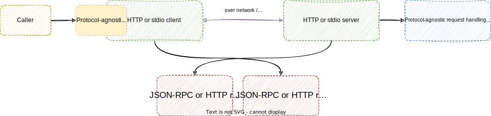

# multilink

  

An IPC library that provides communication for both local and remote processes.
Supports response streaming/events. Built on top of [tower](https://github.com/tower-rs/tower).

Communication between remote processes is performed using an HTTP client and server. Local clients
invoke the server as a child process and communicate via "JSON-RPC over stdio".

One set of request and response types (defined by the caller) is used for both methods of communication.
The HTTP and stdio clients implemented by multilink will both provide a tower service that consumes/produces these types of values.

## Usage

You can configure the supported IPC methods by enabling certain features:

```
[dependencies]
multilink = { version = "<version>", features = ["<http-server|http-client|stdio-server|stdio-client>"] }
```

### Moving parts

Here are the moving parts of a solution that uses multilink:

1. One set of protocol-agnostic request and response types: types that are used in all services, regardless of the underlying protocol; usually a set of enums
2. The handling services: processes the protocol-agnostic requests, performs some logic and returns responses
3. Conversion trait implementations: converts the protocol-agnostic requests/responses into JSON-RPC or HTTP request/responses
4. HTTP and "JSON-RPC over stdio" clients and servers: the only part implemented by multilink; brings the three items above together

The caller of a multilink client will only use the protocol-agnostic request and response types, which allows seamless switching between protocols.



### Local communication

In a local IPC scenario, the client will spawn the server as a child process and communicate with it via stdin/stdout, using JSON-RPC as the protocol.

Protocol-agnostic requests are converted to `JsonRpcRequest`, and responses are converted to either `JsonRpcResponse` or `JsonRpcNotification`.

The client/server combo for this protocol is `StdioServer` and `StdioClient`.

### Remote communication

In a remote IPC scenario, the client will make HTTP requests to a defined server. The library uses [hyper](https://github.com/hyperium/hyper) under the hood to accomplish this.

Protocol-agnostic requests are converted to `HttpRequest<Body>`. Responses are converted to the `ModalHttpResponse` enum, which consists of `Single` and `Multiple` variants.

The client/server combo for this protocol is `HttpServer` and `HttpClient`.

### Streaming responses/notifications

This library supports multiple responses per request. If the service responds with a `Stream` contained in a `ServiceResponse<Response>::Multiple` value, multiple responses will be transmitted.

All streamed responses must be associated with a request.

When converting responses to JSON-RPC messages, a `JsonRpcNotification` must be used, with the original request ID as the method.

For HTTP streaming, [server-sent events](https://developer.mozilla.org/en-US/docs/Web/API/Server-sent_events) is utilized under the hood.

### Examples and reference documentation

For a full example of the above features, see the greeting server and client in the `examples/` directory.

Reference documentation can be found on [docs.rs](https://docs.rs/multilink).

## License

[Mozilla Public License, version 2.0](https://spdx.org/licenses/MPL-2.0.html)